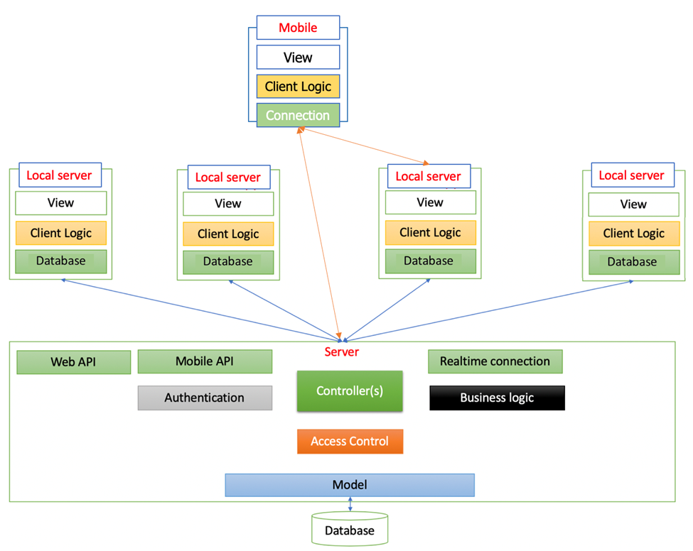

# capstone project - brain tumor  
* Đồ án tốt nghiệp điện tử - viễn thông HCMUT HK232

## Chức năng
* **Auth:** JWT

## Cài đặt

* config database laravel `.env`
```
DB_CONNECTION=mongodb
DB_HOST=127.0.0.1
DB_PORT=27017
DB_DATABASE=web_datn
DB_USERNAME=
DB_PASSWORD=
MONGO_DB_AUTHENTICATION_DATABASE=admin
```
* install package
```
composer install
yarn install
pip -r requirements.txt
```

## Kiến trúc hệ thống



## Công nghệ sử dụng
* BE: Laravel, Flask
* FE: ReactJs
* Database: MongoDB

## Driver MongoDB for Laravel
* PECL https://pecl.php.net/package/mongodb
* Github release: https://github.com/mongodb/mongo-php-driver/releases/

## Contact
* **Email**: hau.nguyenbk8786@gmail.com